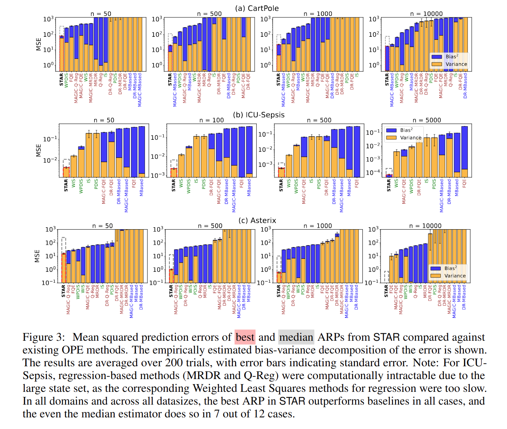

# Abstract Reward Processes: Leveraging State Abstraction for Consistent Off-Policy Evaluation

This repository contains the code for the following paper.

> S. Chaudhari, A. Deshpande, B. Castro da Silva, and P.S. Thomas. Abstract Reward Processes: Leveraging State Abstraction for Consistent Off-Policy Evaluation. In Advances in Neural Information Processing Systems, 2024.


<details>
<summary>Abstract | <a href="https://arxiv.org/abs/2410.02172">Paper</a> </summary>
<br>
Evaluating policies using off-policy data is crucial for applying reinforcement learning to real-world problems such as healthcare and autonomous driving. Previous methods for off-policy evaluation (OPE) generally suffer from high variance or irreducible bias, leading to unacceptably high prediction errors. In this work, we introduce STAR, a framework for OPE that encompasses a broad range of estimators -- which include existing OPE methods as special cases -- that achieve lower mean squared prediction errors. STAR leverages state abstraction to distill complex, potentially continuous problems into compact, discrete models which we call abstract reward processes (ARPs). Predictions from ARPs estimated from off-policy data are provably consistent (asymptotically correct). Rather than proposing a specific estimator, we present a new framework for OPE and empirically demonstrate that estimators within STAR outperform existing methods. The best STAR estimator outperforms baselines in all twelve cases studied, and even the median STAR estimator surpasses the baselines in seven out of the twelve cases.
</details>


## Setup

The codebase follows the code structure of the [Caltech OPE Benchmarking Suite (COBS)](https://github.com/clvoloshin/COBS). Follow instructions for setting up from the COBS repository.


## Experiments

### Abstraction Intialization

We perform [CluSTAR]() to create abstract states. The required clustering centroids must be created by executing `exps/clustar_creation.py` before running the following experiments.

### Running Experiments

The experiments in the paper can be run by specifying the domain name in `launch_jobs.py`. The script has been setup to run on a [SLURM](https://slurm.schedmd.com/documentation.html) managed computer cluster.


To reproduce results in the paper, specify the domain name as `domain = "<domain>"` for experiments in Figure 3 for the corresponding domain. 
Alternatively, specify the domain name as `domain = "<domain>_heatmap"` for experiments in Figure 4.
The corresponding scripts are defined under the `exps/` folder. 

### Algorithm 

The algorithm $\textrm{STAR}(\phi, c)$ is defined in `ope/algos/ours.py`.

### Domains

There are three domains evaluated in this codebase:

1. CartPole: A classic control domain in [OpenAI Gym](https://github.com/openai/gym).
2. ICU-Sepsis: A simulator treatment of sepsis in the ICU from the [ICU-Sepsis environment](https://github.com/icu-sepsis/icu-sepsis).
3. Asterix: A miniaturized version of the Atari game from the [MinAtar testbed](https://github.com/kenjyoung/MinAtar).

The environments are defined in `ope/envs`.


### Results

Additional experiments details may be found in under Empirical Analysis in the paper.



### Bibliography

```
@article{chaudhari2024abstract,
  title={Abstract Reward Processes: Leveraging State Abstraction for Consistent Off-Policy Evaluation},
  author={Chaudhari, Shreyas and Deshpande, Ameet and da Silva, Bruno C and Thomas, Philip S},
  journal={Advances in Neural Information Processing Systems},
  year={2024}
}
```